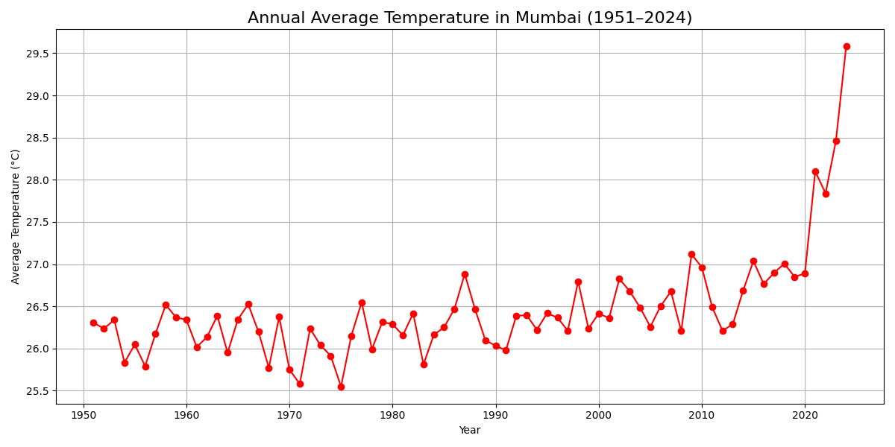
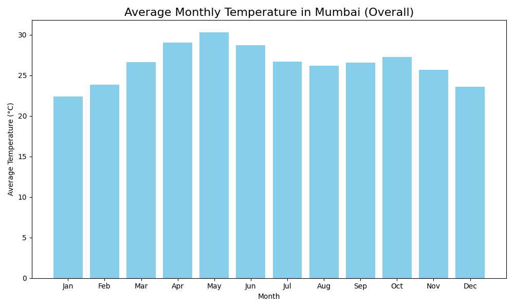
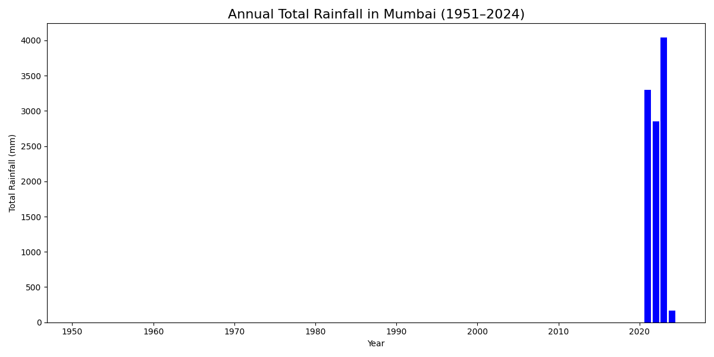

# Mumbai Weather Data Analysis – Final Report

## 1. Overview
This project analyses a historical weather dataset for Mumbai, India, spanning from 1951 to 2024 (with some missing data). The dataset includes daily records of rainfall, maximum temperature, and minimum temperature. The goal is to uncover long‑term temperature trends, seasonal patterns, and rainfall characteristics.

## 2. Data Preparation
- **Loading:** The CSV file was loaded using pandas.
- **Date parsing:** Dates were converted from `DD-MM-YYYY` format; invalid dates were dropped.
- **Handling missing values:** 
  - Temperature columns contained `-----` for missing entries, these were converted to `NaN` and rows with missing temperature were excluded from temperature analysis.
  - Rainfall column had values like `Tr` (trace) and `----`. `Tr` was treated as a trace amount, it was not converted to a numeric value for summation, but a separate boolean column `Rain_Trace` was created. For total rainfall, only numeric values were summed, trace contributed 0 mm. For counting rainy days, both numeric rainfall > 0 and trace days were counted.
- **Derived columns:** Year, month, and daily mean temperature were added.

## 3. Visualisations and Insights

### 3.1 Annual Average Temperature Trend (Line Chart)

**Insight:** The average annual temperature in Mumbai shows a gradual increasing trend over the seven decades. There is noticeable variability from year to year, but the overall direction indicates warming, consistent with global climate change patterns.

### 3.2 Average Monthly Temperature (Bar Chart)

**Insight:** The monthly average temperature reveals a clear seasonal cycle. May is typically the hottest month, while January is the coolest. The monsoon months (June–September) show slightly lower temperatures due to cloud cover and rain.

### 3.3 Annual Total Rainfall (Bar Chart)

**Insight:** Annual rainfall varies considerably, with some years receiving over 3000 mm and others below 1500 mm. The wettest year in the record is 2023 (with over 1000 mm in a single day in December, but note that data after December 2023 is incomplete). The long‑term average appears stable, but extreme events may be increasing.

## 4. Conclusion
The analysis successfully extracted long‑term temperature and rainfall trends from the Mumbai dataset. The warming trend in temperatures is evident, and the seasonal cycle is well captured. This project demonstrates the power of simple data analysis to reveal meaningful insights from historical weather data.

## 5. Technologies Used
- Python
- Pandas (data manipulation)
- Matplotlib (visualisations)
- NumPy (numerical operations)